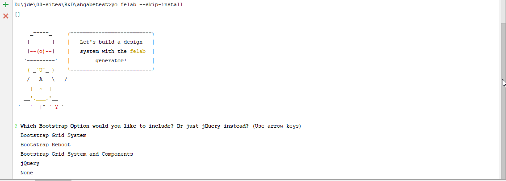

# generator-felab [![NPM version][npm-image]][npm-url] [![Build Status][travis-image]][travis-url] [![Dependency Status][daviddm-image]][daviddm-url]
> 
> [Yeoman](http://yeoman.io) generator that scaffolds out a design system using grunt and gulp for the build process
## Installation

**DO NOT use in production, it is still just a prototype**

First, install [Yeoman](http://yeoman.io) and generator-felab using [npm](https://www.npmjs.com/) (we assume you have pre-installed [node.js](https://nodejs.org/)).

```bash
npm install -g yo
npm install -g JayDeeDee/generator-felab
```

Then generate your new project:

```bash
yo felab
```



## Getting Started
- Install 'npm install -g yo grunt-cli gulp-cli generator-felab'
- Run `yo felab` to scaffold your web design system
- Run `grunt StartServer-DevSync` to start a webserver with watch and browser sync functionality
- Run `grunt Startserver-DevWatch` to start a webserver with watch functionality
- Run `grunt StartServer-VRT` to start a test server for visual regression tests
- Run `grunt Build-Documentation` to build a Sass Documentattion
- Run `grunt Build-For-Dev` to build your code for development
- Run `grunt Build-For-Deploy` to build your code for deployment

## Options
-  `--skip-welcome-msg` do not show the greeting message
-  `--skip-install-msg` do not show the install hint before dependencies are being installed 


- `--skip-install` do not initiate yarn 


- `--use-feature` you can choose between bootstrap grid bootstrap reboot, bootstrap with components or jquery
either `bs-reset`, `bs-grid`, `bs-modules`, `jquery` or `none`. Defaults to `none`
- `--use-velocity` you can use velocity.js for animations
- `--use-vrt` uses backstopJS for visual regression tests (currently not for windows user)

## License

Apache-2.0 © [Jana Deutschländer]()


[npm-image]: https://badge.fury.io/js/generator-felab.svg
[npm-url]: https://npmjs.org/package/generator-felab
[travis-image]: https://travis-ci.org/JayDeeDee/generator-felab.svg?branch=master
[travis-url]: https://travis-ci.org/JayDeeDee/generator-felab
[daviddm-image]: https://david-dm.org/JayDeeDee/generator-felab.svg?theme=shields.io
[daviddm-url]: https://david-dm.org/JayDeeDee/generator-felab
